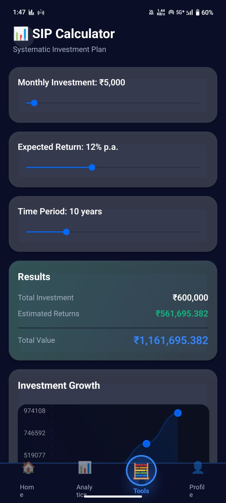

# AI Finance Tracker

A production-quality, AI-powered finance tracking mobile app built with React Native and Expo.

## Features

- 📊 Dashboard with balance tracking and insights
- 📈 Advanced analytics with multiple chart types
- 🧮 6 financial calculators (SIP, Lumpsum, EMI, Credit Card, Inflation, FIRE)
- 🤖 AI-powered transaction categorization using Google Gemini
- 💾 Local-first data storage with export functionality
- 🎨 Glassmorphism UI with smooth animations
- 🌍 Multi-currency support (7 currencies)
- 🎨 Multiple theme variants

## Quick Start

```bash
# Install dependencies
npm install

# Create environment file
cp .env.example .env
# Add your Gemini API key

# Start the app
npm start
```

<p align="center">
  
</p>
<p align="center">
  
</p>
<p align="center">
  
</p>
<p align="center">
  
</p>
<p align="center">
  
</p>


## Tech Stack

- React Native 0.73.4
- Expo ~50.0.0
- TypeScript 5.3.3
- Zustand (State Management)
- React Navigation
- Google Generative AI
- React Native Reanimated

## License

MIT
